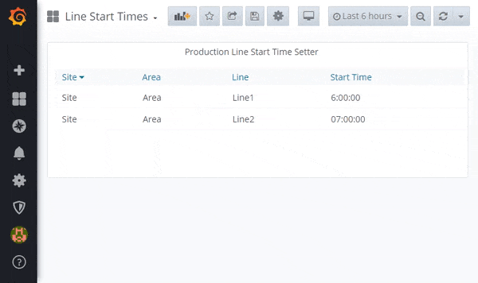
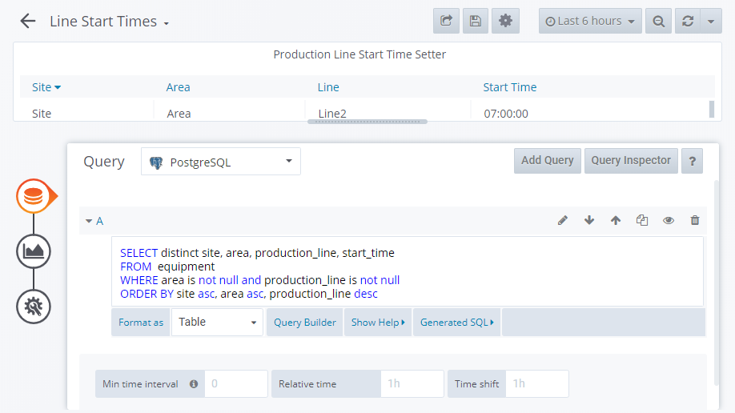

# Libre Production Line Time Setter Panel

> Libre panel to set a Production Line start time

This panel enables users to update the daily production start time for each production line. By clicking a row users can update the start time. This panel is part of [Libre](https://github.com/Spruik/Libre) suite of Grafana plugins and dashbaords. The production line start time limits when orders can be scheduled on the line. This plugin interfaces to a no security json rest api for equipment running on the same grafana server. This panel is targeted at Grafana v6.x.x only.

Equipment objects have 5 properties.

1. site - Name of the site _limited to 50 characters_
2. area - Name of the area _limited to 50 characters_
3. production_line - Name of the line _limited to 50 characters_
4. equipment - Name of the equipment _limited to 50 characters_
5. start_time - time at which orders can be scheduled _limited to 10 characters_



## Installation

The easiest way to get started with this plugin is to [download the latest release](https://github.com/Spruik/Libre-Production-Line-Time-Setter-Panel/releases/latest/download/libre-production-line-time-setter-panel.zip), unzip into grafana plugin directory and restart grafana.

Download the latest release

```shell
$ wget https://github.com/Spruik/Libre-Production-Line-Time-Setter-Panel/releases/latest/download/libre-production-line-time-setter-panel.zip
Resolving github.com (github.com)... 140.82.114.4
...
2020-06-24 20:47:59 (1.08 MB/s) - 'libre-production-line-time-setter-panel.zip' saved [90150]
```

Unzip into your Grafana plugin directory

```shell
$ unzip libre-production-line-time-setter-panel.zip -d /var/lib/grafana/plugins
Archive: libre-production-line-time-setter-panel.zip
...
inflating: /var/lib/grafana/libre-production-line-time-setter-panel/utils.js.map
```

Restart Grafana

```shell
$ service grafana-server restart
 * Stopping Grafana Server
 * Starting Grafana Server
```

## Usage

In order to get the most out of this panel:

1. Add a *Table* metric to query operations. For example

```sql
SELECT
  distinct site
  ,area
  ,production_line
  ,start_time
FROM equipment
WHERE area IS NOT NULL
  AND production_line IS NOT NULL
ORDER BY site ASC
  ,area ASC
  ,production_line DESC
```



### Update

Click a row, enter a new start time and save.

## Developing

### Getting Started

A docker-compose and grunt script is provided in order to quickly evaluate source code changes. This requires

Prerequisites

- docker (>= 18 required)
- docker-compose (>= 1.25 required)
- node (>= 12 required)
- npm (>= 6 required)

Start by cloning this repository

```shell
~/
$ git clone https://github.com/Spruik/Libre-Production-Line-Time-Setter-Panel
Cloning into 'Libre-Production-Line-Time-Setter-Panel'...
remote: Enumerating objects: 46, done.
remote: Counting objects: 100% (46/46), done.
remote: Compressing objects: 100% (31/31), done.
remote: Total 46 (delta 13), reused 46 (delta 13), pack-reused 0
Unpacking objects: 100% (46/46), done.
```

Enter project and install dependencies

```shell
$ cd ./Libre-Production-Line-Time-Setter-Panel
~/Libre-Production-Line-Time-Setter-Panel
$ npm install
...
added 714 packages from 399 contributors and audited 719 packages in 11.871s
found 42 vulnerabilities (11 low, 6 moderate, 25 high)
  run `npm audit fix` to fix them, or `npm audit` for details
```

Install Grunt globally

```shell
$ npm install grunt -g
C:\Users\user\AppData\Roaming\npm\grunt -> C:\Users\user\AppData\Roaming\npm\node_modules\grunt\bin\grunt
+ grunt@1.1.0
updated 1 package in 1.364s
```

Run grunt to build the panel

```shell
$ grunt
Running "clean:0" (clean) task
>> 1 path cleaned.

Running "clean:1" (clean) task
>> 1 path cleaned.

Running "copy:src_to_dist" (copy) task
Created 3 directories, copied 8 files

Running "copy:libs" (copy) task
Copied 1 file

Running "copy:readme" (copy) task
Created 1 directory, copied 7 files

Running "copy:pluginDef" (copy) task
Copied 1 file

Running "babel:dist" (babel) task

Done, without errors.

```

Start docker-compose.dev.yml detached

```shell
~/Libre-Production-Line-Time-Setter-Panel
$ docker-compose -f docker-compose.dev.yml up -d
Starting libre-production-line-time-setter-panel_postgres_1 ... done
Starting libre-production-line-time-setter-panel_postrest_1 ... done
Starting libre-production-line-time-setter-panel_grafana_1   ... done
Starting libre-production-line-time-setter-panel_simulator_1 ... done

```

Run grunt watch to recompile on change

```shell
~/Libre-Production-Line-Time-Setter-Panel
$ grunt watch
Running "watch" task
Waiting...
```

Open your favourite editor and start editing ./src files. The grunt watch task will detect this and recompile the panel. Use your favourite web browser and point to http://localhost:3000 login and create a dashboard with this panel. Your browser will need to be refreshed to reflect your changes to this panel, ensure your browser isn't caching files.

### Building

Prerequisites

- node (>= 12 required)
- npm (>= 6 required)

Build panel and zip into archive

```shell
~/Libre-Production-Line-Time-Setter-Panel
$ grunt build
Running "clean:0" (clean) task
>> 1 path cleaned.

Running "clean:1" (clean) task
>> 1 path cleaned.

Running "clean:0" (clean) task
>> 0 paths cleaned.

Running "clean:1" (clean) task
>> 0 paths cleaned.

Running "copy:src_to_dist" (copy) task
Created 3 directories, copied 8 files

Running "copy:libs" (copy) task
Copied 1 file

Running "copy:readme" (copy) task
Created 1 directory, copied 7 files

Running "copy:pluginDef" (copy) task
Copied 1 file

Running "babel:dist" (babel) task

Running "compress:main" (compress) task
>> Compressed 40 files.

Done, without errors.

```

Find a completed build of this panel in the root directory named `libre-production-line-time-setter-panel.zip`.

## Contributing

For any issue, there are fundamentally three ways an individual can contribute:

- By opening the issue for discussion: For instance, if you believe that you have uncovered a bug in, creating a new issue in the [GitHub issue tracker](https://github.com/Spruik/Libre-Production-Line-Time-Setter-Panel/issues) is the way to report it.
- By helping to triage the issue: This can be done either by providing supporting details (a test case that demonstrates a bug), or providing suggestions on how to address the issue.
- By helping to resolve the issue: Typically, this is done either in the form of demonstrating that the issue reported is not a problem after all, or more often, by opening a Pull Request that changes some bit of something in the panel in a concrete and reviewable manner.

## Change log

- 1.0.0 Initial Public Release
